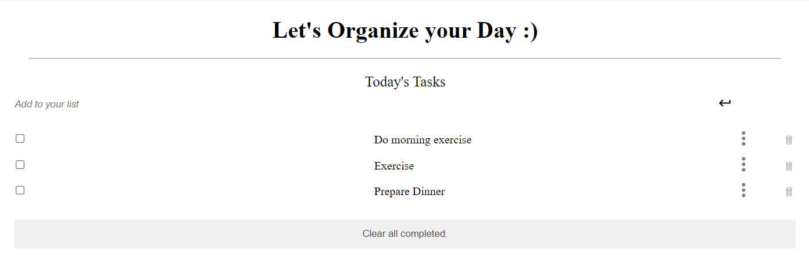

  
   

  <h3><b>Microverse README Template</b></h3>

# 📗 Table of Contents

- [📖 About the Project](#about-project)
  - [🛠 Built With](#built-with)
    - [Tech Stack](#tech-stack)
    - [Key Features](#key-features)
  - [🚀 Live Demo](#live-demo)
- [💻 Getting Started](#getting-started)
  - [Setup](#setup)
  - [Prerequisites](#prerequisites)
  - [Install](#install)
  - [Usage](#usage)
  - [Run tests](#run-tests)
  - [Deployment](#triangular_flag_on_post-deployment)
- [👥 Authors](#authors)
- [🔭 Future Features](#future-features)
- [🤝 Contributing](#contributing)
- [⭐️ Show your support](#support)
- [🙏 Acknowledgements](#acknowledgements)
- [❓ FAQ](#faq)
- [📝 License](#license)

# 📖 [TO-DO-LIST-App] 

> Describe your project in 1 or 2 sentences.

**[TO-DO-LIST-App]** is a...

## 🛠 Built With 

### Tech Stack 

> Describe the tech stack and include only the relevant sections that apply to your project.

  
Client

  <ul>
    <li><a href="https://html.org/">HTML</a></li>
    <li><a href="https://css.org/">CSS</a></li>
    <li><a href="https://js.org/">Vanilla Javascript</a></li>
  </ul>

  
Server

  <ul>
    <li>none</li>
  </ul>

Database

  <ul>
   <li><a href="https://localStorage.com/">Local Storage in the browser</a></li>
  </ul>

### Key Features 

> Describe between 1-3 key features of the application.

- **[Add_new_Task]**
- **[Remove_Task]**
- **[Edit_Task]**

(<a href="#readme-top">back to top</a>)

## Screenshot

## 🚀 Live Demo 

> Add a link to your deployed project.

- [Live Demo Link](https://reemmohamedabdelfatah.github.io/toDOLISTapp/dist/)

(<a href="#readme-top">back to top</a>)

## 💻 Getting Started 

> Describe how a new developer could make use of your project.

To get a local copy up and running, follow these steps.

### Prerequisites

In order to run this project you need:

- Have visual studio Code in your PC.
- Have a verified GitHub account.
- Have a stable browser version.

### Setup

- Clone this repository to your desired folder using terminal:
  git clone https://github.com/ReemMohamedAbdelfatah/toDOLISTapp.git

### Install

Install this project with:

- webpack and linters.

### Usage

To run the project, execute the following command:

- npm run build
- npm run dev

### Run tests

To run tests, run the following command:

Coming Soon ....

### Deployment

You can deploy this project using:

Coming Soon ....

(<a href="#readme-top">back to top</a>)

## 👥 Authors 

> Mention all of the collaborators of this project.

👤 **Reem Muhammed**

- GitHub: [@github](https://github.com/ReemMohamedAbdelfatah)
- LinkedIn: [LinkedIn](https://www.linkedin.com/in/reem-abd-el-fatah-a07543116)

(<a href="#readme-top">back to top</a>)

## 🔭 Future Features 

> Describe 1 - 3 features you will add to the project.

- [ ] **[Better_design]**
- [ ] **[schedule_tasks_on_calendar]**

(<a href="#readme-top">back to top</a>)

## 🤝 Contributing 

Contributions, issues, and feature requests are welcome!

Feel free to check the [issues page](../../issues/).

(<a href="#readme-top">back to top</a>)

<!-- SUPPORT -->

## ⭐️ Show your support 

> Write a message to encourage readers to support your project

If you like this project please star the project and feel free to add your own touches.

(<a href="#readme-top">back to top</a>)

<!-- ACKNOWLEDGEMENTS -->

## 🙏 Acknowledgments 

> Give credit to everyone who inspired your codebase.

I would like to thank...

(<a href="#readme-top">back to top</a>)

<!-- FAQ (optional) -->

## ❓ FAQ 

> Add at least 2 questions new developers would ask when they decide to use your project.

- **[How_to_use_the_app?]**

  - [I puted a small div in the top explaining how to use tha application]

- **[Can_I_Contribute?]**

  - [Sure, you're free to contribute and add your own touches]

(<a href="#readme-top">back to top</a>)

<!-- LICENSE -->

## 📝 License 

This project is [MIT](./LICENSE) licensed.

_NOTE: we recommend using the [MIT license](https://choosealicense.com/licenses/mit/) - you can set it up quickly by [using templates available on GitHub](https://docs.github.com/en/communities/setting-up-your-project-for-healthy-contributions/adding-a-license-to-a-repository). You can also use [any other license](https://choosealicense.com/licenses/) if you wish._

(<a href="#readme-top">back to top</a>)

